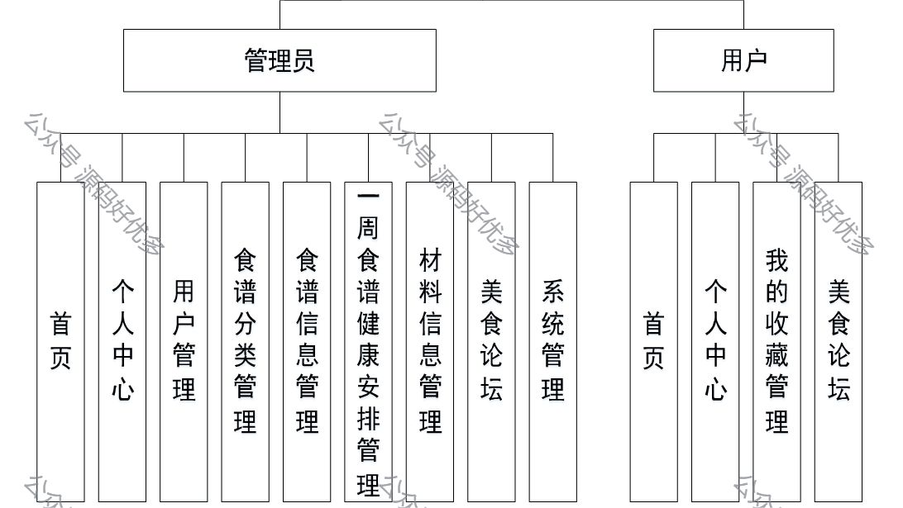
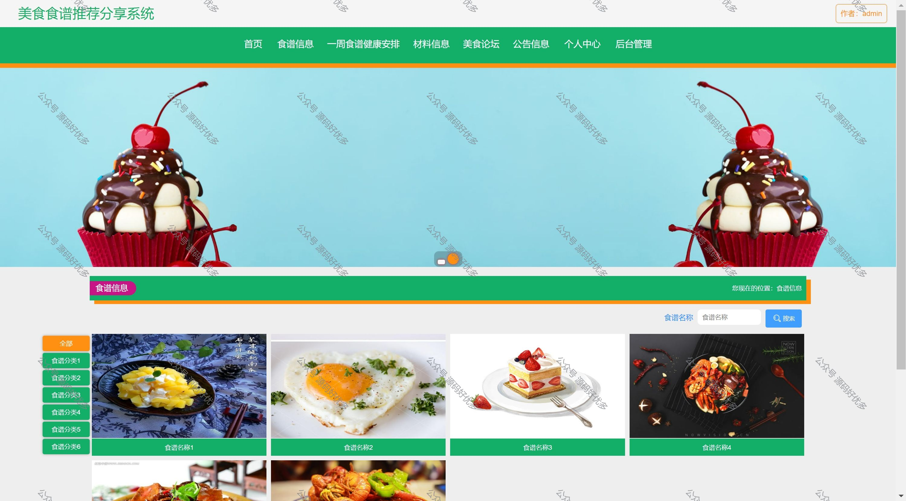
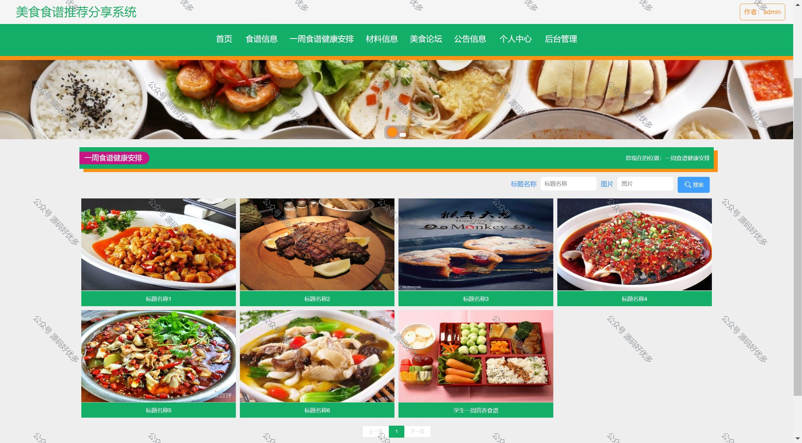
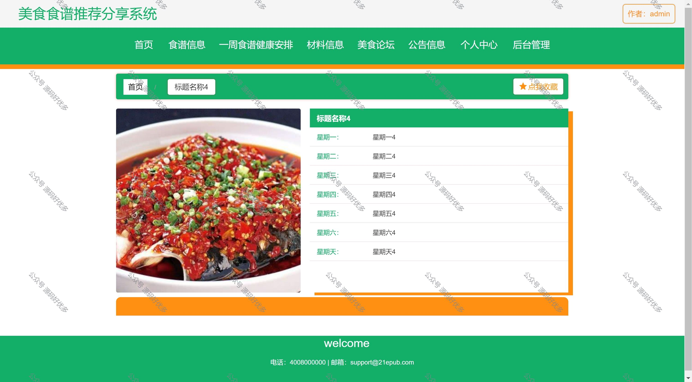
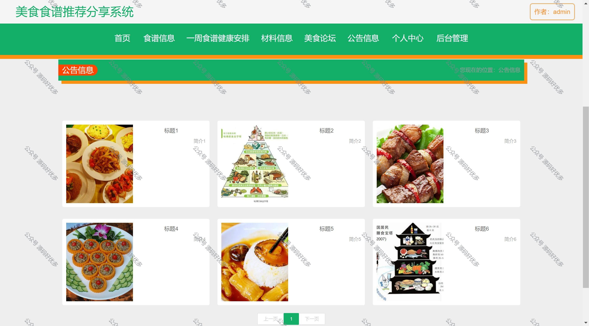
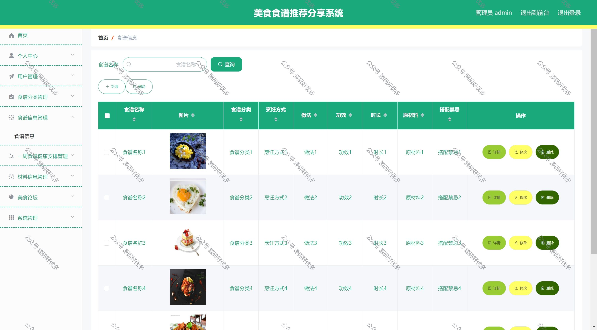
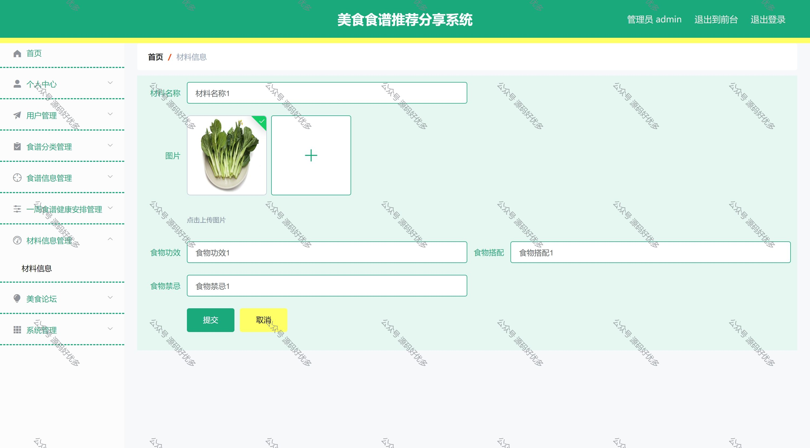
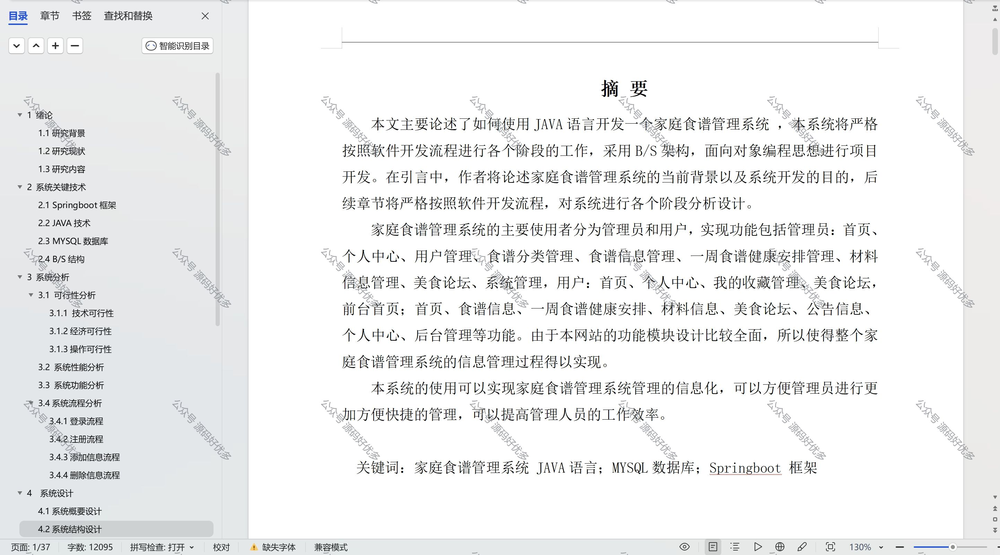

 
## 查看主页获取源码

> **作者介绍**： **✌**全网粉丝10W+本平台特邀作者、博客专家、CSDN新星计划导师、java领域优质创作者,博客之星、掘金/华为云/阿里云/InfoQ等平台优质作者、专注于毕业项目实战 **✌**

  

### 一、作品包含

源码+数据库+设计文档万字+PPT+全套环境和工具资源+部署教程

### 二、项目技术

前端技术：Html、Css、Js、Vue、Element-ui

数据库：MySQL

后端技术：Java、Spring Boot、MyBatis

### 三、运行环境

开发工具：IDEA

数据库：MySQL8.0

数据库管理工具：Navicat10以上版本

环境配置软件： JDK1.8+Maven3.6.3

前端Nodejs：14

### 四、项目介绍
项目编号：springbootA051

家庭食谱管理系统的主要使用者分为管理员和用户，实现功能包括管理员：首页、个人中心、用户管理、食谱分类管理、食谱信息管理、一周食谱健康安排管理、材料信息管理、美食论坛、系统管理，用户：首页、个人中心、我的收藏管理、美食论坛，前台首页；首页、食谱信息、一周食谱健康安排、材料信息、美食论坛、公告信息、个人中心、后台管理等功能。由于本网站的功能模块设计比较全面，所以使得整个家庭食谱管理系统的信息管理过程得以实现

### 五、运行截图

